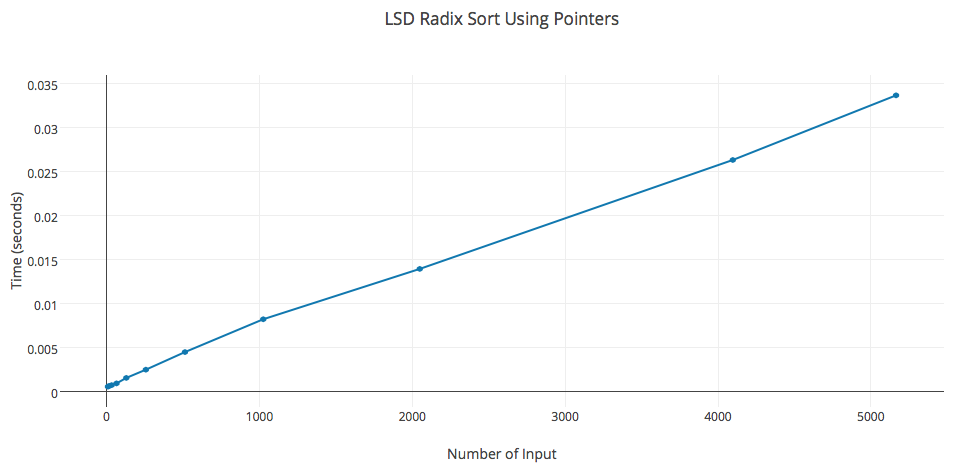
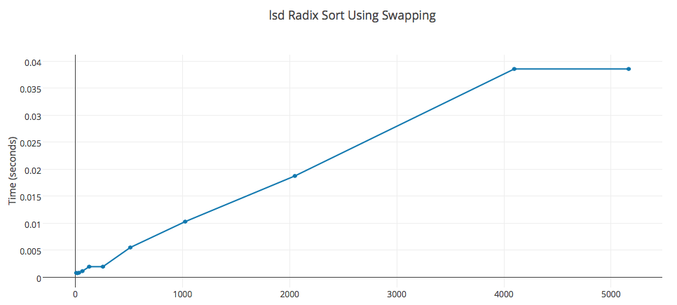

#LSD Radix Sort Algorithm Implementation

Extract the file by

	$ mkdir -p program3 && tar -xvf program3.tar.gz -C program3

Compile the program 

	$ make

Run the program

	$ make run input=f.txt output=g.txt 

Here

* f.txt is the input file 
* g.txt is output file 

Then choose whether to run lsd using pointers or swap 
	
	Please select technique for sorting: 
	1        Using pointer array  
	2        Using Swapping

# Analysis

## Time Complexity

LSD Radix Sort is linear time sorting algorithm. It is a stable sort. I have implemented lsd Radix sort using two different method.

- First Method makes use of pointers to keep track of indices without swapping the values 

- Second Method swaps the values in each cycle

Both the algorithms of lsd Radix sort takes O(n) asymptotic time. 

\newpage

## LSD Radix Sort Using pointers 

n        k     time (s) 
----  -------  -------
8       21     0.000591
16      21     0.000674
32      21     0.000762
64      21     0.000961 
128     21     0.001582
256     21     0.002517
512     21     0.004514 
1024    21     0.008236 
2048    21     0.013947
4096    21     0.0263 
5164    21     0.033631

\newpage 

## LSD Radix Sort Using Swapping

n        k     time (s) 
----  -------  -------
8       21     0.000773 
16      21     0.000715
32      21     0.000798
64      21     0.001096  
128     21     0.001924
256     21     0.003028
512     21     0.005486
1024    21     0.010274
2048    21     0.018737
4096    21     0.038562
5164    21     0.045842 

## Author

Tushar Sharma `tushar.sharma1729@gmail.com`

## License

    This program is free software: you can redistribute it and/or modify
    it under the terms of the GNU General Public License as published by
    the Free Software Foundation, either version 3 of the License, or
    (at your option) any later version.

    This program is distributed in the hope that it will be useful,
    but WITHOUT ANY WARRANTY; without even the implied warranty of
    MERCHANTABILITY or FITNESS FOR A PARTICULAR PURPOSE.  See the
    GNU General Public License for more details.

    You should have received a copy of the GNU General Public License
    along with this program.  If not, see <http://www.gnu.org/licenses/>.

